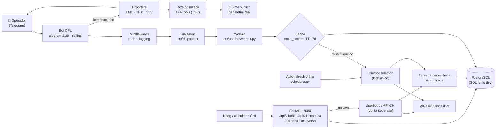
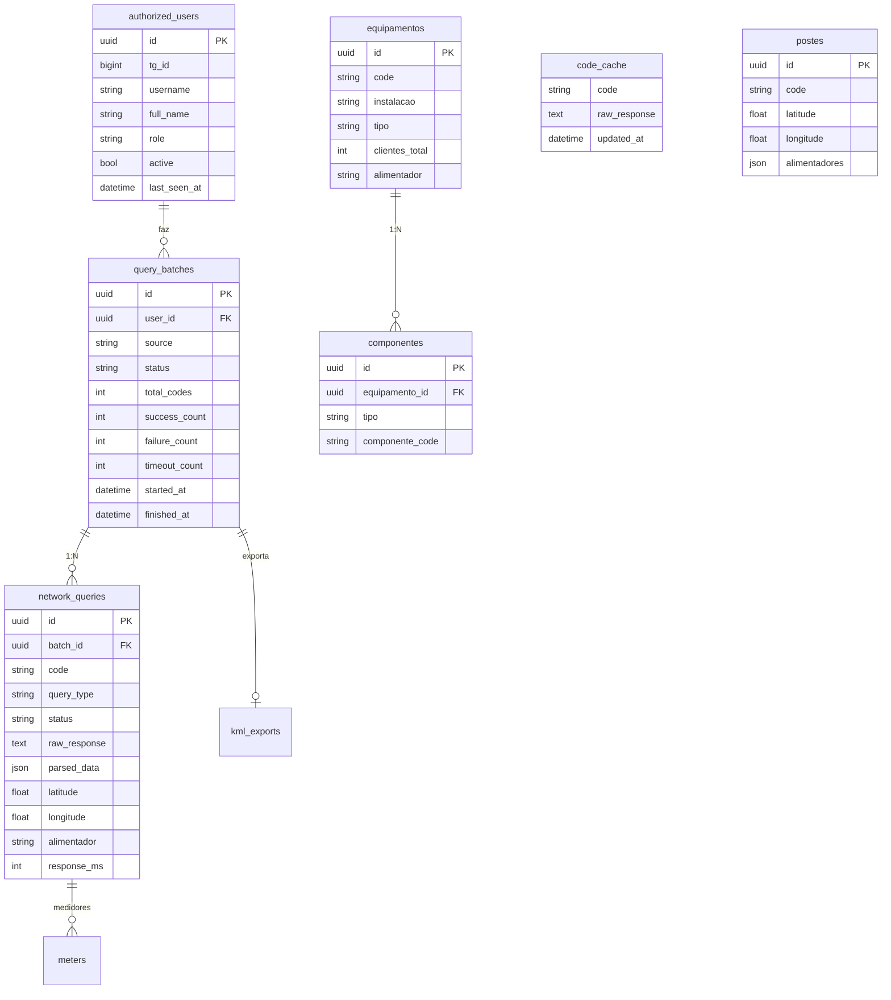

<!-- readme-padrao:v1 -->
<div align="center">

# 🤖 Bot Integrador DPL Construções

**Bot de automação para consulta de dados de rede elétrica via Telegram.**
Integra-se ao `@ReincidenciasBot`, processa lotes de consultas em paralelo, persiste em banco e exporta como
**KML + GPX + CSV** (OsmAnd, Google Earth, Excel) — e responde a API de CHI usada pela equipe técnica.


<!-- PREENCHER: adicionar captura (dados mascarados) em doc/imagens/ — chat do bot com um lote concluído e a página /historico -->

<sub><b>No ar</b> · serviço de produção rodando sem parar desde 24/07/2026 · dev alinhado com a produção em 30/09/2026</sub>

</div>

---

<details>
<summary><b>🧭 Sumário</b> — clique para expandir</summary>

- [💡 O que é](#-o-que-é)
- [✨ Destaques](#-destaques)
- [🖼️ Imagens](#️-imagens)
- [🏗️ Arquitetura](#️-arquitetura)
- [🚀 Instalação e uso](#-instalação-e-uso)
  - [Uso do bot](#uso-do-bot)
- [⚙️ Configuração](#️-configuração)
- [🗄️ Modelo de dados](#️-modelo-de-dados)
- [🔐 Segurança](#-segurança)
- [🧪 Testes](#-testes)
- [🧭 Troubleshooting](#-troubleshooting)
- [📊 Roadmap](#-roadmap)
- [📁 Estrutura do projeto](#-estrutura-do-projeto)
- [📚 Documentação](#-documentação)
- [🔗 Projetos relacionados](#-projetos-relacionados)
- [🤝 Créditos](#-créditos)
- [📄 Licença](#-licença)

</details>

---

## 💡 O que é

O **Bot Integrador DPL Construções** é uma ponte automatizada entre operadores de campo e o sistema de consulta de rede
elétrica (`@ReincidenciasBot`). O operador manda um ou centenas de códigos no Telegram; uma conta de usuário (userbot
Telethon) consulta o bot externo, o resultado é guardado em banco com cache e devolvido no chat, junto com arquivos
para abrir no mapa. A mesma base atende uma API REST de CHI consumida pela equipe técnica.

| Problema | Solução |
|----------|---------|
| 🐌 Consultas manuais uma a uma no `@ReincidenciasBot` | ⚡ Lotes de até **500 códigos** processados pela fila |
| 📋 Resultados perdidos em texto puro no chat | 🗄️ **Persistência estruturada** em banco com histórico e cache |
| 🗺️ Coordenadas isoladas sem visualização geográfica | 📍 Exportação **KML + GPX + CSV** para Google Earth, OsmAnd e Excel |

**Quem usa?** Operadores de campo, despachantes e analistas da distribuidora de energia que precisam consultar dados de
**postes** (alimentador, estruturas, cabos, coordenadas) e de **equipamentos/instalações** (medidores, chave montante,
componentes) e plotar os pontos em mapa para inspeção e planejamento.

| | |
|---|---|
| 🎯 **Para quê** | Consultar a rede elétrica em lote pelo Telegram, guardar o resultado e gerar mapas/rotas |
| 🧰 **Tecnologias** | Python 3.11 · aiogram 3.28 · Telethon 1.43 · SQLAlchemy 2.0 async · PostgreSQL/SQLite · FastAPI · OR-Tools · simplekml |
| 🔌 **Acesso** | Bot no Telegram · dashboard/API na porta `8080` (`/historico`, `/conversa`, `/api/v1/...`, `/docs`) |
| 📦 **Requisitos** | Python 3.11+, credenciais de API do Telegram ([my.telegram.org](https://my.telegram.org)), token de bot ([@BotFather](https://t.me/BotFather)), acesso ao `@ReincidenciasBot`, PostgreSQL em produção |

## ✨ Destaques

<details open>
<summary><b>🗄️ Cache inteligente de consultas</b></summary>

- ✅ **1 registro por código único** no banco — sem duplicatas (`code_cache`)
- ✅ Consulta repetida entregue **instantaneamente** do banco, sem chamar o bot externo
- ✅ **TTL de 7 dias** — com menos de 7 dias é servido do cache; acima disso, o cache é entregue e atualizado em **background**
- ✅ Três cenários cobertos automaticamente:
  - Código no cache e fresco → entrega imediata
  - Código no cache mas desatualizado → entrega imediata + atualização em background
  - Código novo → consulta o bot externo, salva e entrega
- ✅ Indicador visual no resultado: `📦 cache (2h atrás)` ou `📦 cache desatualizado (8d atrás) — atualizando…`
- ✅ **Auto-refresh diário**: códigos vencidos e ainda em uso (acessados nos últimos 60 dias) são reconsultados de madrugada, distribuídos por dia da semana (hash estável do código) para não sobrecarregar o bot externo
- ✅ Respostas estruturadas em `postes`, `equipamentos` e `componentes`; códigos que o bot externo diz não existir vão para `codigos_nao_cadastrados`

</details>

<details>
<summary><b>🔍 Consultas em lote</b></summary>

- ✅ Aceita **1 código, vários códigos** (separados por vírgula/espaço/linha) ou **arquivo `.txt`**
- ✅ Limite de **500 códigos por lote**
- ✅ Processamento **assíncrono** via fila interna
- ✅ Estado persistente — sobrevive a reinicializações do bot
- ✅ Resultados individuais entregues em tempo real no chat, com mensagem de progresso

</details>

<details>
<summary><b>🛰️ Userbot inteligente</b></summary>

- ✅ Cliente Telethon que se loga como usuário real para consultar `@ReincidenciasBot`
- ✅ Detecção automática de **timeout**, **erro** e **resposta vazia**
- ✅ Parser que extrai coordenadas, alimentador, estruturas e cabos
- ✅ **Health-check de conexão** (a cada 20 s): detecta queda da sessão, tenta reconectar e alerta os super admins no privado se a queda persistir
- ✅ Consultas serializadas (`asyncio.Lock`) — worker em tempo real e auto-refresh de madrugada nunca conversam com o bot externo ao mesmo tempo
- ✅ Sessão Telethon guardada no banco (tabela `telethon_sessions`), não em arquivo
- ✅ Segunda conta Telegram, exclusiva da API de CHI, com sessão e lock próprios

</details>

<details>
<summary><b>📍 Exportação geográfica</b></summary>

- ✅ **KML (Google Earth)** com placemarks agrupados por alimentador + linha da rota otimizada (geometria OSRM)
- ✅ **GPX de postes** (OsmAnd) com rota otimizada (TSP via OR-Tools) e navegação multi-parada
- ✅ **GPX de equipamentos** com ícones contextuais:
  - 🔴 Transformadores → Rosa (#E91E63)
  - 🟠 Chaves fusível → Laranja (#FF9800)
  - 🔵 Equipamentos genéricos → Ciano (#00BCD4)
- ✅ **CSV** (2 arquivos: postes + equipamentos, delimitador `;`)
- ✅ Botão “📍 Baixar” com todos os arquivos
- ✅ Comando `/kml <id_lote>` para recuperar lotes antigos
- ✅ Coordenadas gravadas como recebidas, sem arredondamento — compatível com OsmAnd, Organic Maps e Garmin

</details>

<details>
<summary><b>🔔 Notificações, 🛡️ acesso e 🌐 API</b></summary>

- ✅ Mensagem de **conclusão do lote** com estatísticas: total, sucessos, erros, timeouts e duração
- ✅ Lista de usuários autorizados (`authorized_users`) gerenciada pelo próprio bot (`/autorizar`, `/desautorizar`, `/promover`, `/usuarios`)
- ✅ Middleware de autenticação em todos os handlers; `/whoami` mostra o próprio perfil
- ✅ API FastAPI: `POST /api/v1/consulta` e `GET /api/v1/chi/{codigo}` (cache-first), com documentação automática em `/docs` (Swagger)
- ✅ Páginas web `/historico` (lotes e consultas) e `/conversa`

</details>

## 🖼️ Imagens

<!-- PREENCHER: adicionar captura (dados mascarados) em doc/imagens/ — o repositório ainda não tem imagens próprias -->

Ainda sem capturas no repositório.

## 🏗️ Arquitetura



`src/main.py` sobe **num só processo**: bot (polling), worker da fila, auto-refresh do cache e o servidor web/API
(uvicorn na porta `8080`).

| Camada | Função | Tech |
|--------|--------|------|
| **Bot** | Interface Telegram | aiogram 3.28 |
| **Userbot** | Consultas via conta de usuário | Telethon 1.43 |
| **Dispatcher** | Fila assíncrona | asyncio |
| **Cache** | 1 linha por código, TTL 7 dias, refresh em background | `src/services/cache_service.py` |
| **Parsing** | Poste / equipamento / “não encontrado” | `src/parsing/` |
| **Route Opt** | Otimização da ordem de visita (TSP) | OR-Tools |
| **OSRM** | Geometria real da rota | OSRM público (`router.project-osrm.org`) |
| **Exporters** | Arquivos gerados | simplekml + XML (GPX) + CSV |
| **Database** | Persistência ORM | SQLAlchemy 2.0 async + Alembic |
| **API** | Endpoints REST e páginas web | FastAPI 0.115 + uvicorn |

Contrato e histórico da API de CHI: [`API_CHI.md`](API_CHI.md).

## 🚀 Instalação e uso

Pré-requisitos: **Python 3.11+**, credenciais de API do Telegram ([my.telegram.org](https://my.telegram.org)),
token de bot ([@BotFather](https://t.me/BotFather)) e acesso ao `@ReincidenciasBot` (ou similar).

```bash
# 1. Clone o repositório
git clone git@github.com:Josue04Santos/bot-integrador.git
cd bot-integrador

# 2. Crie e ative o virtualenv
python3 -m venv venv
source venv/bin/activate    # Linux/Mac
# venv\Scripts\activate     # Windows

# 3. Instale as dependências
pip install -r requirements.txt
pip install -r requirements-dev.txt   # testes

# 4. Configure variáveis de ambiente
cp .env.example .env
nano .env                    # edite com suas credenciais

# 5. Rode as migrations do banco
alembic upgrade head

# 6. Suba o bot (bot + worker + auto-refresh + dashboard :8080)
python -m src.main
```

**Primeiro login do userbot** — na primeira execução o Telethon pede o código de verificação enviado ao Telegram e a
senha 2FA (se ativada). A sessão fica salva no banco (`telethon_sessions`, linha `userbot`) — não precisa logar de novo.
A conta da API de CHI faz o login à parte, uma vez: `python -m scripts.login_consulta_api` (linha `userbot_consulta_api`).

> ⚠️ **Dev e produção usam o mesmo banco e as mesmas contas Telegram.** Rodar o bot do dev (ou uma migration) mexe nos
> dados reais e derruba a sessão da produção. Separe o banco de dev antes de testar — ver [`CLAUDE.md`](CLAUDE.md).

| Quero | Comando |
|---|---|
| Subir (local) | `python -m src.main` |
| Subir / reiniciar (produção, systemd) | `sudo systemctl restart bot-integrador` (só com OK; unidade em [`deploy/systemd/`](deploy/systemd/bot-integrador.service)) |
| Ver logs (produção) | `journalctl -u bot-integrador -f` |
| Atualizar a produção | `git pull` na pasta de produção + restart |
| Desfazer | `git checkout <hash anterior>` na pasta de produção + restart |
| Diagnóstico do banco | `python -m scripts.db_status` |
| Dashboard separado | `python -m scripts.dashboard` → `http://localhost:8080/historico` |

<details>
<summary>🧰 Scripts utilitários (<code>scripts/</code>)</summary>

| Script | O que faz |
|---|---|
| `init_db.py` | Bootstrap do banco — cria tabelas e semeia a lista de autorizados (SQLite e PostgreSQL) |
| `migrate_cache.py` | Migração `network_queries` → `code_cache` (resultado mais recente de cada código) |
| `backfill_estruturado.py` | Backfill único de `postes`/`equipamentos`/`componentes` a partir do `code_cache` |
| `db_status.py` | Diagnóstico operacional do banco |
| `debug_bot_externo.py` | Observa e loga o fluxo conversacional do `@ReincidenciasBot` |
| `login_consulta_api.py` | Login inicial da conta Telegram exclusiva da API de CHI |
| `dashboard.py` | Sobe só o dashboard web, separado do serviço principal |
| `test_bot_mensagens.py` | Teste isolado do bot de chat com outro token de bot |

</details>

### Uso do bot

| Comando | Função | Menu |
|---|---|---|
| `/start` | Menu inicial com opções **POSTE** e **EQUIPAMENTO** | todos |
| `/help` | Ajuda completa | todos |
| `/status` | Status do bot e da fila | todos |
| `/whoami` | Mostra seu perfil e permissões | super admin |
| `/kml` | Ajuda do exportador | super admin |
| `/kml <id>` | Baixa os arquivos de um lote (primeiros 8 caracteres do UUID) | super admin |
| `/autorizar` · `/desautorizar` | Autoriza / desativa um usuário | super admin |
| `/usuarios` · `/promover` | Lista usuários / promove a admin | super admin |
| `/naocadastrados` · `/excluirnaocadastrado` | Lista / remove códigos marcados como não cadastrados | super admin |

A coluna **Menu** indica onde o comando aparece no menu “/” do Telegram; super admins são os IDs de `SUPER_ADMIN_IDS`.

<details>
<summary>Fluxo típico — consulta de poste</summary>

```
1. /start
2. Clica em 🏗️ POSTE
3. Envia: 12345 67890 11111
4. Aguarda processamento (~3s por código consultado ao vivo)
5. Recebe resultados individuais
6. Recebe mensagem 🎉 Lote concluído!
7. Clica em [📍 Baixar]
8. Recebe arquivos prontos para Google Earth / OsmAnd / Excel
```

</details>

<details>
<summary>Formatos de entrada</summary>

```
# Um código
12345

# Vários códigos (vírgula, espaço ou quebra de linha)
12345, 67890, 11111
12345 67890 11111

# Arquivo .txt (envie como anexo)
12345
67890
11111
```

</details>

## ⚙️ Configuração

Modelo sem valores: [`.env.example`](.env.example). Lido por `src/utils/config.py` (pydantic-settings, nomes sem
diferenciar maiúsculas).

<details open>
<summary>Variáveis</summary>

| Grupo | Variável | Para que serve | Padrão |
|---|---|---|---|
| 🤖 Bot (aiogram) | `TELEGRAM_BOT_TOKEN` | Token do @BotFather | — (obrigatório) |
| 🤖 Bot | `WEBHOOK_ENABLED`, `TELEGRAM_WEBHOOK_URL`, `TELEGRAM_WEBHOOK_SECRET` | Reservadas para webhook — **o código atual não as lê** (o bot roda em polling) | `false` / vazio |
| 🛰️ Userbot do bot DPL | `BOT_TELEGRAM_API_ID`, `BOT_TELEGRAM_API_HASH`, `BOT_TELEGRAM_PHONE` | Conta Telegram que consulta o bot externo (my.telegram.org; telefone com DDI) | — (obrigatório) |
| 🛰️ Userbot | `BOT_TERCEIRO_USERNAME`, `BOT_TERCEIRO_TIMEOUT` | Bot consultado e timeout em segundos | `ReincidenciasBot` / `30` |
| 🛰️ Userbot | `TELEGRAM_SOURCE_CHAT_ID` | Grupo/canal monitorado (opcional) | `0` |
| 🛰️ Userbot da API CHI | `CHI_TELEGRAM_API_ID`, `CHI_TELEGRAM_API_HASH`, `CHI_TELEGRAM_PHONE` | Conta separada da API; vazia = API só em modo cache | vazio |
| 🔄 Auto-refresh | `CACHE_AUTO_REFRESH_ENABLED`, `CACHE_AUTO_REFRESH_HOUR`, `CACHE_AUTO_REFRESH_ACTIVITY_DAYS` | Liga o job diário, hora (0–23) e janela de uso | `true` / `4` / `60` |
| 🗄️ Banco | `DATABASE_BACKEND` | `sqlite` ou `postgres` | `sqlite` |
| 🗄️ Banco | `SQLITE_PATH` | Arquivo SQLite | `./data/bot_integrador.db` |
| 🗄️ Banco | `POSTGRES_HOST`, `POSTGRES_PORT`, `POSTGRES_DB`, `POSTGRES_USER`, `POSTGRES_PASSWORD` | PostgreSQL (produção) | `localhost` / `5432` / `bot_integrador` / `bot_user` / — |
| ⚙️ Aplicação | `APP_ENV`, `APP_DEBUG`, `APP_LOG_LEVEL` | `development`/`production` (JSON nos logs em produção), debug, nível | `development` / `true` / `INFO` |
| 🌐 API | `API_KEY` | Chave da `POST /api/v1/consulta` (header `X-API-Key` ou `?api_key=`) | valor de dev — **trocar** |
| 🌐 API | `API_HOST`, `API_PORT` | Declaradas, **não usadas**: a API sobe junto com o bot na porta `8080` | `0.0.0.0` / `8000` |
| 👑 Admin | `SUPER_ADMIN_IDS` | IDs Telegram (separados por vírgula) com comandos de admin e alertas | vazio |
| ⏱️ Consultas | `DELAY_BETWEEN_QUERIES`, `RATE_LIMIT_DELAY`, `CONSULTA_TIMEOUT`, `MAX_CONSULTAS_BATCH` | Ritmo das consultas ao bot externo | `3.0` / `2.0` / `30.0` / `50` |
| 📂 Pastas | `SESSIONS_PATH`, `LOGS_PATH`, `OUTPUT_PATH` | Criadas automaticamente | `./sessions` / `./logs` / `./output` |

</details>

> Segredos ficam fora do Git (`.env` está no `.gitignore`). Nunca escreva senha, token ou IP de produção neste arquivo.

**Autorizar usuários** — um super admin (ID em `SUPER_ADMIN_IDS`) usa `/autorizar` no próprio bot; `/promover` dá papel
de admin. Para o primeiro cadastro em banco novo há `python -m scripts.init_db`.

## 🗄️ Modelo de dados

<details>
<summary>Entidades principais (<code>src/database/</code>)</summary>



Outras tabelas: `agent_runs` (jobs de automação), `codigos_nao_cadastrados`, `telethon_sessions` (sessões dos userbots)
e as legadas `usuarios`.

</details>

<details>
<summary>Migrations (Alembic)</summary>

```bash
# Criar nova migration
alembic revision --autogenerate -m "descrição"

# Aplicar migrations
alembic upgrade head

# Reverter última
alembic downgrade -1

# Ver histórico
alembic history
```

Em produção, migration só com OK — dev e produção compartilham o banco.

</details>

## 🔐 Segurança

- **Bot**: toda mensagem passa pelo middleware de whitelist — só usuários ativos em `authorized_users` são atendidos (callbacks de botão não passam por ele); comandos de gestão só para `SUPER_ADMIN_IDS`.
- **API**: `POST /api/v1/consulta` exige `API_KEY` (header `X-API-Key` ou `?api_key=`); o padrão do código é um valor de dev e precisa ser trocado no `.env`.
- **Sessões Telegram** dos userbots ficam na tabela `telethon_sessions` e em `sessions/` — tratar como senha, nunca versionar nem apagar.
- **`.env`** (tokens do bot, `API_ID`/`API_HASH`/telefone de duas contas, Postgres, `API_KEY`) fica fora do Git.
- **`repomix-output.md`** é um dump do código inteiro — conferir que não contém `.env` antes de compartilhar.
- **Risco conhecido**: dev e produção usam o mesmo banco e as mesmas contas (ver [`CLAUDE.md`](CLAUDE.md) › 8.1).

## 🧪 Testes

| Camada | Comando | Cobre |
|---|---|---|
| Unitários | `venv/bin/python -m pytest tests -q` | `test_route_optimizer.py` (TSP) e `test_gpx_osmand.py` (GPX para OsmAnd) |
| Legados | `tests/legacy/` | Scripts antigos de validação de GPX, menu, userbot e lotes específicos |

<details>
<summary>Smoke tests rápidos</summary>

```bash
# 1) Importações OK?
python -c "from src.bot.application import create_dispatcher; print('✅')"

# 2) Worker compila?
python -c "from src.userbot.worker import worker_loop; print('✅')"

# 3) Exporters compilam?
python -c "from src.exporters import generate_bundle; print('✅')"

# 4) Pipeline completo?
python -c "
from src.bot.application import create_dispatcher
from src.userbot.worker import worker_loop
from src.exporters import generate_bundle
dp = create_dispatcher()
print(f'✅ {len(dp.sub_routers)} sub-routers ativos')
"
```

</details>

<details>
<summary>Logs estruturados e testes manuais</summary>

O projeto usa **structlog** — JSON em produção (`APP_ENV=production`), colorido em dev, sempre na saída padrão
(em produção, no journal do systemd).

```bash
# Filtrar logs do worker
python -m src.main 2>&1 | grep worker

# Guardar em arquivo
python -m src.main 2>&1 | tee logs/bot.log
```

```bash
# Sobe o bot
python -m src.main

# No Telegram:
/start           # menu inicial
/whoami          # confirma autorização
/status          # estado da fila
12345            # envia código direto após /start
```

Relatório de um teste em massa real: [`TESTE_MASSA_01_07.md`](TESTE_MASSA_01_07.md).

</details>

## 🧭 Troubleshooting

<details>
<summary>❌ <code>ModuleNotFoundError: No module named 'src...'</code></summary>

```bash
# Solução: execute como módulo, não como script
python -m src.main         # ✅ correto
python src/main.py         # ❌ errado
```

</details>

<details>
<summary>❌ Telethon pede código toda vez que sobe o bot</summary>

A sessão não está sendo persistida. Verifique se o banco configurado é o mesmo da execução anterior e se a tabela
`telethon_sessions` tem a linha `userbot` (ou `userbot_consulta_api` para a conta da API).

</details>

<details>
<summary>❌ <code>@ReincidenciasBot</code> não responde</summary>

Verifique se o userbot tem o bot terceiro no histórico: abra o Telegram com a conta do userbot e mande `/start`
manualmente para o bot terceiro. Para observar a conversa: `python -m scripts.debug_bot_externo`
(diagnóstico registrado em [`ANALISE_BOT_EXTERNO.md`](ANALISE_BOT_EXTERNO.md)).

</details>

<details>
<summary>❌ KML não abre no Google Earth</summary>

- Certifique-se de ter coordenadas válidas (lat ≠ 0, lng ≠ 0)
- Tente abrir no Google Earth Web (https://earth.google.com)
- Valide o XML: `xmllint --noout output/<arquivo>.kml`

</details>

<details>
<summary>❌ Lote fica travado em “queued”</summary>

O worker pode ter caído. Veja os logs (`journalctl -u bot-integrador` em produção, ou a saída do terminal) filtrando
por `worker` e reinicie o bot (Ctrl+C e `python -m src.main`, ou restart do serviço com OK).

</details>

<details>
<summary>❌ GPX não gera rota no OsmAnd</summary>

Ver [`OSMAND_ROTAS.md`](OSMAND_ROTAS.md), [`OSMAND_ROTAS_COMPARACAO.md`](OSMAND_ROTAS_COMPARACAO.md) e
[`SOLUCAO_FINAL.md`](SOLUCAO_FINAL.md).

</details>

## 📊 Roadmap

<details>
<summary>✅ Concluído</summary>

- µ1 — Bootstrap do projeto (aiogram + Telethon)
- µ2 — Banco com SQLAlchemy 2.0 async
- µ3 — Fila de consultas + worker
- µ4 — Parser de respostas do `@ReincidenciasBot`
- µ5 — Handlers `/start`, `/help`, `/status`, `/whoami`
- µ6 — Fluxo POSTE e EQUIPAMENTO
- µ7 — Persistência completa de lotes e queries
- µ8 — Exportação KML + CSV 📍
  - Bloco 1: Exporters (KML agrupado por alimentador + CSV BR)
  - Bloco 2: Handler `/kml` + botão inline
  - Bloco 3: Notificação automática de conclusão
- µ9 — Cache inteligente de consultas (`code_cache` + TTL 7d + refresh em background)
- µ10 — Gestão de usuários pelo bot (entregue como `/autorizar`, `/desautorizar`, `/promover`, `/usuarios`)
- µ13 — PostgreSQL em produção
- Tabelas estruturadas (`postes`/`equipamentos`/`componentes`) e API de CHI ([`API_CHI.md`](API_CHI.md))

</details>

<details>
<summary>🔄 Em backlog / parcial</summary>

- µ9 — Polimento UX: distinguir “não cadastrado” de sucesso (parcial: lista `codigos_nao_cadastrados` + comandos de admin)
- µ11 — Histórico de lotes no bot (`/historico`) — hoje existe só a página web `/historico`
- µ12 — Dashboard web (FastAPI + HTMX) — parcial: páginas `/historico` e `/conversa`
- µ14 — Dockerfile + docker-compose — arquivos em `deploy/docker/` ainda vazios
- µ15 — CI/CD (GitHub Actions)
- µ16 — Testes automatizados (pytest) — parcial: 2 suítes em `tests/`
- Separar o banco de dev do de produção

</details>

<details>
<summary>🛠️ Stack técnica (versões de <code>requirements.txt</code>)</summary>

**Core**

| Lib | Versão | Função |
|---|---|---|
| aiogram | 3.28.2 | Framework para o bot Telegram |
| Telethon | 1.43.2 | Cliente userbot |
| SQLAlchemy | 2.0.49 | ORM async |
| aiosqlite | 0.22.1 | Driver SQLite async (dev) |
| asyncpg | 0.30.0 | Driver PostgreSQL async (prod) |
| alembic | 1.13.3 | Migrations |
| pydantic | 2.13.4 | Validação de dados |
| pydantic-settings | 2.14.1 | Carregamento de `.env` |

**Exportação, rotas e parsing**

| Lib | Versão | Função |
|---|---|---|
| simplekml | 1.3.6 | Geração de KML |
| lxml | 5.3.0 | Parser XML |
| ortools | 9.15.6755 | Otimização de rota (TSP) |
| pandas / numpy | 3.0.3 / 2.4.6 | Apoio a dados |

**API e infraestrutura**

| Lib | Versão | Função |
|---|---|---|
| FastAPI | 0.115.0 | API REST e páginas web |
| uvicorn | 0.32.0 | Servidor ASGI |
| httpx | 0.27.2 | Cliente HTTP async (OSRM) |
| structlog | 25.5.0 | Logs estruturados |
| aiofiles | 24.1.0 | I/O async em arquivos |
| pytest / pytest-asyncio / pytest-cov | 9.0.3 / 1.3.0 / 7.1.0 | Testes |

</details>

## 📁 Estrutura do projeto

<details>
<summary>Árvore comentada</summary>

```
bot-integrador/
├── src/
│   ├── main.py                          # entry point: bot + worker + auto-refresh + web :8080
│   ├── config.py                        # instância única de settings
│   │
│   ├── bot/                             # 🤖 TELEGRAM BOT
│   │   ├── application.py               # bot, dispatcher, menu "/" do Telegram
│   │   ├── handlers/
│   │   │   ├── start.py                 # /start, /status
│   │   │   ├── help.py
│   │   │   ├── query.py                 # postes + equipamentos (até 500 por lote)
│   │   │   ├── export.py                # /kml e download KML/GPX/CSV
│   │   │   ├── whoami.py
│   │   │   ├── admin.py                 # /autorizar, /desautorizar, /usuarios, /promover
│   │   │   └── nao_cadastrados.py       # /naocadastrados, /excluirnaocadastrado
│   │   ├── keyboards/
│   │   ├── middlewares/                 # auth + logging
│   │   └── states/                      # FSM
│   │
│   ├── userbot/                         # 🛰️ TELETHON (conta do bot DPL)
│   │   ├── client.py                    # sessão no banco, lock, health-check
│   │   ├── worker.py                    # loop de consultas
│   │   ├── scheduler.py                 # auto-refresh diário do cache
│   │   └── session_manager.py
│   ├── userbot_consulta_api/            # 🛰️ TELETHON (conta exclusiva da API CHI)
│   │
│   ├── dispatcher/queue.py              # 📥 FILA
│   │
│   ├── parsing/                         # 🔎 parser novo: poste, equipamento, detecção
│   ├── exporters/                       # 📦 ARQUIVOS
│   │   ├── gpx_builder.py               # GPX postes + rota
│   │   ├── gpx_equipamentos.py          # GPX equipamentos
│   │   ├── kml_builder.py
│   │   ├── csv_builder.py               # CSV postes
│   │   ├── csv_equipamentos.py          # CSV equipamentos
│   │   ├── parser.py · parser_equipamento.py
│   │   ├── adapter.py                   # → route optimizer
│   │   ├── maps_link.py
│   │   └── styles.py
│   │
│   ├── services/                        # 🧠 LÓGICA
│   │   ├── cache_service.py             # code_cache + TTL
│   │   ├── persistencia_estruturada.py  # upsert postes/equipamentos/componentes
│   │   ├── nao_cadastrado_service.py
│   │   ├── route_optimizer.py           # TSP (OR-Tools)
│   │   ├── osrm_client.py               # geometria real
│   │   ├── route_models.py
│   │   └── parser.py
│   │
│   ├── database/                        # 🗄️ PERSISTÊNCIA
│   │   ├── models.py                    # lotes, consultas, cache, usuários
│   │   ├── models_estruturados.py       # postes, equipamentos, componentes
│   │   ├── models_nao_cadastrado.py
│   │   ├── models_legado.py
│   │   ├── connection.py
│   │   └── types.py
│   │
│   ├── api/                             # 🌐 REST (FastAPI)
│   │   ├── main.py                      # /health, /api/v1/consulta
│   │   ├── deps.py                      # verificação da API_KEY
│   │   └── routes/                      # chi, historico, conversa
│   │
│   ├── models/schemas.py
│   └── utils/
│       ├── config.py                    # Settings (pydantic-settings)
│       └── logger.py                    # structlog
│
├── scripts/                             # 🧰 utilitários (ver "Instalação e uso")
├── tests/                               # 🧪 pytest + legacy/
├── alembic/                             # 🔄 migrations
├── deploy/                              # systemd (real); docker, nginx e scripts ainda vazios
├── data/                                # 🗃️ SQLite (dev)
├── sessions/                            # 🔐 sessões Telethon antigas (não versionar)
├── output/                              # 📂 KML/GPX/CSV
├── logs/
├── doc/README.md                        # índice da documentação
├── .env.example
├── requirements.txt · requirements-dev.txt
├── alembic.ini
├── CLAUDE.md                            # ficha operacional
└── README.md
```

</details>

## 📚 Documentação

| Guia | Assunto |
|---|---|
| [`doc/README.md`](doc/README.md) | Índice de toda a documentação (inclusive relatórios antigos) |
| [`API_CHI.md`](API_CHI.md) | Contrato e status da API de CHI (`GET /api/v1/chi/{codigo}`) |
| [`CLAUDE.md`](CLAUDE.md) | Ficha operacional: dev × produção, deploy, segredos, pegadinhas, pendências |
| [`OSMAND_ROTAS.md`](OSMAND_ROTAS.md) | Guia de roteirização automática no OsmAnd |
| [`ANALISE_BOT_EXTERNO.md`](ANALISE_BOT_EXTERNO.md) | Diagnóstico do comportamento do `@ReincidenciasBot` |

## 🔗 Projetos relacionados

| Projeto | Relação |
|---|---|
| `@ReincidenciasBot` | Bot externo consultado pelos userbots (fonte dos dados de rede) |
| Naeg (cálculo de CHI) | Consumidor da API `GET /api/v1/chi/{codigo}` |

<!-- PREENCHER: confirmar se ~/projetos/dev/fluxo-operacional (bot/userbot/KML, mai/2026) é o antecessor deste projeto e linkar -->

## 🤝 Créditos

### Pessoas

| Quem | Papel | Perfil / link |
|---|---|---|
| **Josué** ([@Josue04Santos](https://github.com/Josue04Santos)) | Idealização, direção, desenvolvimento e uso | [github.com/Josue04Santos](https://github.com/Josue04Santos) |
| DPL Construções | Cliente (terceirizada) | <!-- PREENCHER: link --> |
| <!-- PREENCHER: nome --> | <!-- PREENCHER: papel --> | <!-- PREENCHER: link --> |

⚡ Bot Integrador DPL · Construído por Josué Santos em Imperatriz/MA

### Inteligências artificiais

| Quem | Contribuição | Link |
|---|---|---|
| **Claude** (Claude Code) — [Anthropic](https://www.anthropic.com) | Implementação de partes do bot, API de CHI, relatórios e documentação | [claude.com/claude-code](https://claude.com/claude-code) |
| **ARIA-BUILDER** | Assistência arquitetural (metodologia µ-tasks) | <!-- PREENCHER: link --> |
| <!-- PREENCHER: outra IA --> | <!-- PREENCHER: contribuição --> | <!-- PREENCHER: link --> |

### Projetos de terceiros

| Projeto | Uso aqui | Licença / origem |
|---|---|---|
| [aiogram](https://github.com/aiogram/aiogram) | Bot Telegram | MIT |
| [Telethon](https://github.com/LonamiWebs/Telethon) | Userbots | MIT |
| [SQLAlchemy](https://github.com/sqlalchemy/sqlalchemy) · [Alembic](https://github.com/sqlalchemy/alembic) | ORM e migrations | MIT |
| [FastAPI](https://github.com/fastapi/fastapi) | API e páginas web | MIT |
| [OR-Tools](https://github.com/google/or-tools) | Otimização de rota (TSP) | Apache-2.0 |
| [simplekml](https://pypi.org/project/simplekml/) | Geração de KML | LGPL-3.0 |
| [OSRM](https://project-osrm.org) | Geometria de rota (servidor público de demonstração) | BSD-2-Clause; dados © colaboradores do OpenStreetMap (ODbL) |
| [structlog](https://github.com/hynek/structlog) | Logs estruturados | MIT / Apache-2.0 |

## 📄 Licença

Uso interno — repositório privado. Sem arquivo LICENSE: todos os direitos reservados.
Projeto proprietário — uso interno DPL Construções. Distribuição, cópia ou uso externo requer autorização expressa.
Componentes de terceiros mantêm as licenças originais.

<div align="center">
<sub>↩ <a href="doc/README.md">Índice da documentação</a> · <a href="#-bot-integrador-dpl-construções">🔝 Voltar ao topo</a> · DPL Construções</sub>
</div>
